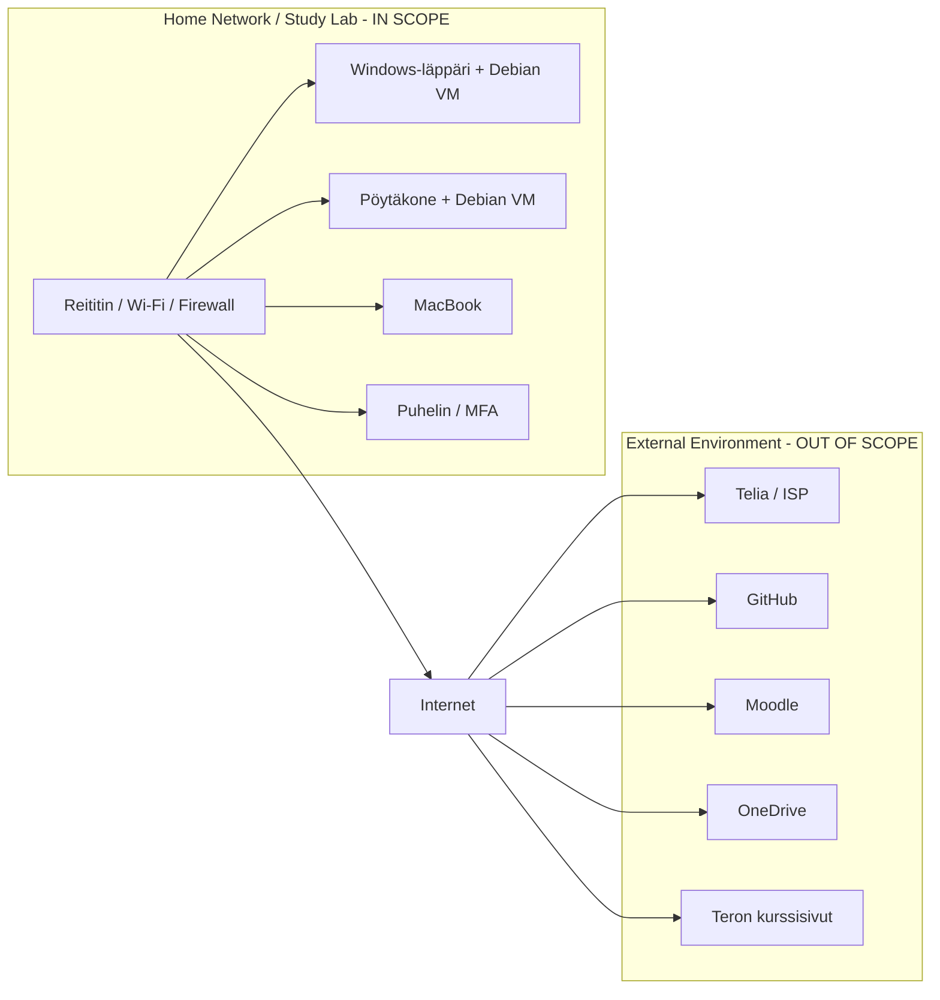

# h1 Freedom of Action, Control, and Risk Mitigation

## a) ISMS-scope

### a1) Mitä ISMS-scopeeni kuuluu?

ISMS-scopeeni kuuluu oma kotiverkkoni ja IT-ympäristö, jota käytän opiskeluun ja kurssin harjoitusten tekemiseen.

**Infrastruktuuri:**
- Reititin ja Wi-Fi-verkko
- Reitittimen palomuuri

**Laitteet:**
- Windows-läppäri, jossa on Debian Linux -virtuaalikone
- Pöytäkone, jossa on Debian Linux -virtuaalikone
- MacBook, jota käytän ohjelmointiin kursseilla
- Puhelin, jota käytän MFA-autentikointiin

**Informaatio ja data:**
- Moodlessa olevat kurssimateriaalit
- Teron kurssisivuilla olevat kurssimateriaalit
- Omat GitHub-repositoriot
- Opiskeluun liittyvät OneDrive-tiedostot
- Omat kurssimuistiinpanot
- Kursseihin liittyvät tunnistetiedot ja autentikointitiedot

Debian-virtuaalikoneet kuuluvat scopeen, koska niitä käytetään kurssin kyberturvallisuusharjoituksiin ja niiden tulee olla erillään muusta ympäristöstä harjoitusten aikana.

### a2) Mitä ISMS-scopeeni ei kuulu ja miksi?

Seuraavat asiat eivät kuulu ISMS-scopeeni:

- **Smart TV**, koska sitä ei käytetä opiskeluun tai kurssin harjoituksiin.
- **Henkilökohtaiset tiedostot ja tunnukset**, jotka eivät liity kurssitöiden tekemiseen.
- **Muiden henkilöiden laitteet**, koska ne eivät kuulu omaan study lab -ympäristööni eivätkä ole omassa hallinnassani.
- **ISP:n infrastruktuuri oman reitittimeni ulkopuolella**, koska se ei ole omassa hallinnassani.

Nämä on rajattu scopesta ulos, koska ne eivät ole kurssin kannalta tarpeellisia tai niitä ei ole mahdollista hallita itse.

### a3) Rajat ja rajapinnat

Ympäristöni tärkeimmät rajat ja rajapinnat ovat:

- **Reititin / Wi-Fi:** muodostaa pääasiallisen rajan oman kotiverkon ja Internetin välillä. Reitittimen palomuuri suojaa kotiverkkoa ulkoiselta liikenteeltä.
- **ISP (Telia):** tarjoaa Internet-yhteyden, mutta Telian oma infrastruktuuri on oman ISMS-scopen ulkopuolella.
- **GitHub:** ulkoinen pilvipalvelu, jossa säilytän koodirepositorioita.
- **Moodle:** Haaga-Helian ulkoinen oppimisympäristö, jota käytän kurssimateriaaleihin ja tehtäviin.
- **OneDrive:** ulkoinen pilvipalvelu opiskeluun liittyvien tiedostojen tallentamiseen.
- **Teron kurssisivut:** ulkoinen palvelu, josta käytän kurssimateriaaleja.
- **Debian-virtuaalikoneet:** muodostavat erillisen labraympäristön fyysisten tietokoneiden sisällä.
- **MFA:** puhelin toimii rajapintana ulkoisiin autentikointipalveluihin silloin, kun sitä käytetään MFA-tunnistautumiseen.

Kotiverkon ja Internetin välinen raja kulkee käytännössä reitittimen kautta. Ulkoiset pilvipalvelut ja muut Internetissä sijaitsevat palvelut ovat ympäristöni ulkopuolella, mutta niihin liittyvät omat käyttäjätilini ja opiskeluun liittyvä data kuuluvat scopeen siltä osin kuin niitä käytetään opiskeluun.

## Verkko- ja rajapintakaavio

## What evidence could I present?

- **Reititin ja Wi-Fi:** Kuvakaappaus reitittimen asetussivulta, josta voidaan todentaa verkon ja Wi-Fi:n asetukset.

- **Laitteet:** Laiteluettelo, josta näkyvät ISMS-scopeen kuuluvat tietokoneet ja puhelin.

- **Virtuaalikoneet:** Kuvakaappaus virtuaalikoneohjelmistosta, josta näkyvät kurssilla käytettävät Debian-virtuaalikoneet.

- **GitHub:** Linkki kurssitehtävissä käytettyyn GitHub-repositorioon.

- **Moodle:** Kuvakaappaus Moodle-kurssista, josta voidaan todentaa kurssimateriaalien käyttö.

- **OneDrive:** Kuvakaappaus opiskeluun liittyvistä OneDrive-tiedostoista.

- **MFA:** Kuvakaappaus käyttäjätilin turvallisuusasetuksista, josta näkyy MFA:n olevan käytössä.

- **Verkon rajat:** Verkko- ja rajapintakaavio, josta näkyvät kotiverkon, Internetin ja ulkoisten palveluiden väliset rajat.

## b) Linking the Assignment to the Standard

| Interested Party | Need or Requirement | ISO 27001 Reference (Requirement Area) | How Compliance Is Demonstrated (Evidence) |
|---|---|---|---|
| **Opiskelija (minä)** | Kurssitehtävien ja harjoitusten tulee olla käytettävissä ja omien tietojen sekä repositorioiden tulee säilyä turvassa. | **Context / Leadership / Planning** | Laitteiden ja virtuaalikoneiden dokumentointi, varmuuskopiot sekä GitHub- ja OneDrive-tiedostojen säilytys. |
| **Haaga-Helia / kurssin järjestäjä** | Kurssiharjoitukset tehdään luvallisesti ja turvallisesti. Harjoitukset eivät saa aiheuttaa haittaa muille järjestelmille tai sisältää luvatonta tietojen käsittelyä. | **Context / Operation** | Kurssin scope- ja rajausdokumentaatio, harjoitusten dokumentointi sekä kurssin sääntöjen ja annettujen ohjeiden noudattaminen. |
| **Pilvipalveluiden tarjoajat (GitHub, Microsoft)** | Tilien ja opiskeluun liittyvien tietojen tulee olla suojattuja. Käyttöehtoja ja turvallisuusvaatimuksia tulee noudattaa. | **Support / Operation** | MFA:n käyttöönotto, tilien turvallisuusasetukset sekä GitHub- ja OneDrive-käyttöoikeuksien tarkistaminen. |

