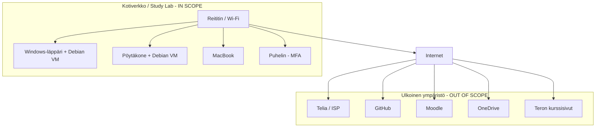

# h1 Freedom of Action, Control, and Risk Mitigation

## a1) Mitä ISMS-scopeeni kuuluu?

ISMS-scopeeni kuuluu oma kotiverkkoni ja IT-ympäristö, jota käytän opiskeluun ja kurssin harjoitusten tekemiseen.

**Infrastruktuuri:**
- Reititin ja Wi-Fi-verkko

**Laitteet:**
- Windows-läppäri, jossa on Debian Linux -virtuaalikone
- Pöytäkone, jossa on Debian Linux -virtuaalikone
- MacBook, jota käytän ohjelmointiin kursseilla
- Puhelin, jota käytän MFA-autentikointiin

**Informaatio ja data:**
- Moodlessa olevat kurssimateriaalit
- Teron kurssisivuilla olevat kursseihin liittyvät materiaalit
- Omat GitHub-repositoriot
- Opiskeluun liittyvät OneDrive-tiedostot
- Omat kurssimuistiinpanot
- Kursseihin liittyvät tunnistetiedot ja autentikointitiedot

## a2) Mitä ISMS-scopeeni ei kuulu ja miksi?

Seuraavat asiat eivät kuulu ISMS-scopeeni:

- **Smart TV**, koska sitä ei käytetä kurssitehtävien tekemiseen tai opiskeluun
- **Henkilökohtaiset tiedostot ja tunnukset**, jotka eivät liity kurssitöiden tekemiseen
- **ISP:n infrastruktuuri oman reitittimeni ulkopuolella**, koska se ei ole omassa hallinnassani

## a3) Rajat ja rajapinnat

Ympäristöni tärkeimmät rajat ja rajapinnat ovat:

- **ISP (Telia):** tarjoaa Internet-yhteyden oman kotiverkkoni ja ulkoisen ympäristön välillä
- **Reititin / Wi-Fi:** muodostaa pääasiallisen rajan kotiverkon ja Internetin välille
- **GitHub:** ulkoinen pilvipalvelu, jossa säilytän koodirepositorioita
- **Moodle:** Haaga-Helian ulkoinen oppimisympäristö, jota käytetään kurssimateriaaleihin ja tehtäviin
- **OneDrive:** ulkoinen pilvipalvelu opiskeluun liittyvien tiedostojen tallentamiseen
- **Teron kurssisivut:** ulkoinen palvelu, josta käytän kurssimateriaaleja
- **Debian-virtuaalikoneet:** toimivat erillisenä labraympäristönä kurssin harjoituksia varten

## Scope description

ISMS-scopeeni kuuluu oma kotiverkkoni sekä IT-ympäristö, jota käytän Haaga-Helian opiskeluun ja Sovellusten hakkerointi ja haavoittuvuudet -kurssin harjoituksiin. Scopeen kuuluvat kotiverkon infrastruktuurina reititin ja Wi-Fi-verkko. Laitteisiin kuuluvat Windows-läppäri, jossa käytän Debian Linux -virtuaalikonetta, pöytäkone, jossa käytän Debian Linux -virtuaalikonetta, MacBook sekä puhelin, jota käytän autentikointiin ja MFA-tunnistautumiseen.

Scopeen kuuluvaa informaatiota ja dataa ovat Moodleen tallennetut kurssimateriaalit, Teron kurssisivuilla olevat materiaalit, omat GitHub-repositoriot, opiskeluun liittyvät OneDrive-tiedostot sekä omat kurssimuistiinpanoni. Debian-virtuaalikoneet kuuluvat scopeen, koska niitä käytetään kurssin kyberturvallisuusharjoitusten suorittamiseen.

Scopeen eivät kuulu laitteet, joita ei käytetä opiskeluun tai kurssin harjoituksiin. Esimerkiksi Smart TV on rajattu ulkopuolelle, koska se ei liity kurssitehtävien tekemiseen. Myös henkilökohtaiset tiedostot ja käyttäjätilit, jotka eivät liity kurssitöiden tekemiseen, eivät kuulu scopeen. Lisäksi Internet-palveluntarjoajan oma infrastruktuuri oman reitittimeni ulkopuolella on rajattu scopesta ulos, koska sitä ei ole omassa hallinnassani.

Keskeinen verkon raja on oman kotiverkon ja Internetin välillä. Reititin ja Wi-Fi muodostavat rajapinnan oman ympäristön ja Internetin välillä, ja Telia toimii Internet-palveluntarjoajana. Oma ympäristöni on yhteydessä ulkoisiin pilvipalveluihin, kuten GitHubiin, Moodleen ja OneDriveen, sekä Teron kurssisivuihin Internetin kautta. Debian-virtuaalikoneet muodostavat erillisen labraympäristön fyysisten tietokoneiden sisällä. Puhelin toimii rajapintana autentikointipalveluihin silloin, kun sitä käytetään MFA-tunnistautumiseen.

ISMS-scope on rajattu siten, että se kattaa opiskeluun ja kurssin harjoituksiin liittyvät laitteet, tiedot, verkon sekä niiden väliset yhteydet, mutta jättää ulkopuolelle ympäristöt ja tiedot, joita ei tarvita kurssin suorittamiseen tai joita en pysty hallitsemaan.

## Verkko- ja rajapintakaavio

## What evidence could I present?

- **Reititin ja Wi-Fi:** Kuvakaappaus reitittimen asetussivulta, josta voidaan todentaa verkon ja Wi-Fi:n asetukset.

- **Laitteet:** Laiteluettelo, josta näkyvät ISMS-scopeen kuuluvat tietokoneet ja puhelin.

- **Virtuaalikoneet:** Kuvakaappaus virtuaalikoneohjelmistosta, josta näkyvät kurssilla käytettävät Debian-virtuaalikoneet.

- **GitHub:** Linkki kurssitehtävissä käytettyyn GitHub-repositorioon.

- **Moodle:** Kuvakaappaus Moodle-kurssista, josta voidaan todentaa kurssimateriaalien käyttö.

- **OneDrive:** Kuvakaappaus opiskeluun liittyvistä OneDrive-tiedostoista.

- **MFA:** Kuvakaappaus käyttäjätilin turvallisuusasetuksista, josta näkyy MFA:n olevan käytössä.

- **Verkon rajat:** Verkko- ja rajapintakaavio, josta näkyvät kotiverkon, Internetin ja ulkoisten palveluiden väliset rajat.

## b) Linking the Assignment to the Standard

| Interested Party | Need or Requirement | ISO 27001 Reference (Requirement Area) | How Compliance Is Demonstrated (Evidence) |
|---|---|---|---|
| **Opiskelija (minä)** | Kurssitehtävien ja harjoitusten tulee olla käytettävissä ja omien tietojen sekä repositorioiden tulee säilyä turvassa. | **Context / Leadership / Planning** | Laitteiden ja virtuaalikoneiden dokumentointi, varmuuskopiot sekä GitHub- ja OneDrive-tiedostojen säilytys. |
| **Haaga-Helia / kurssin järjestäjä** | Kurssiharjoitukset tehdään luvallisesti ja turvallisesti. Harjoitukset eivät saa aiheuttaa haittaa muille järjestelmille tai sisältää luvatonta tietojen käsittelyä. | **Context / Operation** | Kurssin scope- ja rajausdokumentaatio, harjoitusten dokumentointi sekä kurssin sääntöjen ja annettujen ohjeiden noudattaminen. |
| **Pilvipalveluiden tarjoajat (GitHub, Microsoft)** | Tilien ja opiskeluun liittyvien tietojen tulee olla suojattuja. Käyttöehtoja ja turvallisuusvaatimuksia tulee noudattaa. | **Support / Operation** | MFA:n käyttöönotto, tilien turvallisuusasetukset sekä GitHub- ja OneDrive-käyttöoikeuksien tarkistaminen. |

